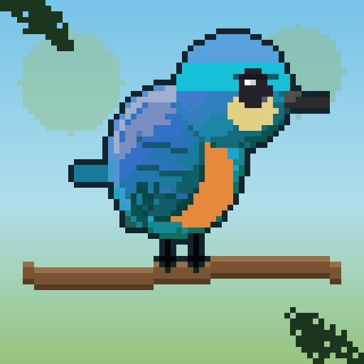

# Bird Pocket

**화면 구석의 작은 새 정원 — 전 세계의 새를 모으는 데스크톱 위젯 게임**

made by **Woo JaeHyeon**

[**⬇ 다운로드 (Windows · macOS)**](https://github.com/woopo666/bird-pocket/releases/latest)

---

## 🌿 소개

Bird Pocket은 화면 한구석에 늘 떠 있는 **데스크톱 펫 위젯**입니다.
잔잔한 픽셀아트 정원에 세계 각지의 새가 날아오고, 먹이를 주며 새를 모으고 도감을 채워가는 **느긋한 힐링 수집 게임**이에요. 일은 시키지 않습니다 — 그냥 두면 새가 찾아옵니다. 🍃

---

## ✨ 주요 기능

- 🗺 **62개국 · 12대륙 · 568종**의 새 — 지역마다 고유한 풍경·랜드마크·새
- 🎨 **절차적 픽셀아트** — 새·풍경·아이템·UI 아이콘을 전부 코드로 렌더링 (외부 이미지 0)
- 🍽 **먹이주기** — 먹이 12종에 따라 찾아오는 새가 달라짐 (빵·씨앗·지렁이·꽃꿀·물고기…)
- 📖 **도감** — 새를 클릭해 수집, 등급(★)별 하이라이트, 실제 사진 + 한국어 설명·등장 확률
- 🌦 **날씨·시간대·계절** — 실제 시각 연동, 맑음/비/눈 + 아침/낮/노을/밤, 계절 변화
- 🎵 **나라별 BGM** — 40개국 고유 음계·악기를 절차적 합성 (일본 코토, 인도 시타르, 스페인 플라멩코, 페루 팬플루트, 아라비아 우드…) — 오디오 파일 0
- 🛒 **상점 · 🎨 꾸미기** — 먹이/소품 구매, 정원을 **땅·물 위 자유 배치**
- 🐤 **펫** — 업적으로 얻은 동물이 정원을 돌아다님 (집 위치 커스텀)
- 🏆 **도전과제 30여 종** — 수집·여행·꾸미기·먹이 다양성·날씨별 플레이 등, 보상으로 치장 아이템
- ☁️ **Google 로그인 + 클라우드 저장** — 어느 기기에서 로그인해도 진행도 이어서
- 🏅 **랭킹** — 전체/대륙별 도감 수·도전 수 **글로벌 순위**, 금·은·동 시상대 + 대표새, 유저별 도감 진행도 보기

---

## ⬇ 다운로드 & 설치

[**최신 릴리스 페이지 →**](https://github.com/woopo666/bird-pocket/releases/latest)

| OS | 파일 | 설치 |
|----|------|------|
| **Windows** | `BirdPocket-1.0.0.exe` | 더블클릭 (설치 불필요한 포터블). 경고 시 → **추가 정보 → 실행** |
| **macOS** (Apple Silicon) | `BirdPocket-1.0.0-arm64.dmg` | Applications로 드래그 → **시스템 설정 → 개인정보 보호 및 보안 → "그래도 열기"** |

> 서명/공증을 하지 않은 개인 배포라 처음 한 번 보안 경고가 뜹니다(정상). 자세한 순서는 릴리스의 `how-to-run.txt` 참고.
> 첫 실행 시 🐦 화면에서 **Google 로그인** 후 시작됩니다. (Intel Mac은 별도 빌드 필요)

---

## 🎮 조작

- 날아온 **새를 클릭** → 도감 등록 + 코인 획득 (마우스 호버로 이름·등급 확인)
- 하단 메뉴: 🍽 먹이대 · 🛒 상점 · 🗺 지도 · 📖 도감 · 🏆 도전 · 🏅 랭킹 · 🎨 꾸미기 · ⚙️ 설정
- 🗺 **지도**에서 대륙·나라 이동 / 🎨 **꾸미기**에서 소품·펫 드래그 배치
- 창 모서리를 드래그해 크기 조절, 우측 상단 ✕로 닫기

---

## 🛠 기술 스택

- **Electron** — 프레임리스·항상-위·투명 데스크톱 위젯 (로그인 위해 내부 `127.0.0.1` 서빙)
- **Canvas 2D** 절차적 픽셀아트 렌더러 + **Web Audio** 합성 사운드 (이미지·오디오 파일 0)
- **Firebase** — Google 인증 · Firestore 클라우드 저장 · 공개 리더보드
- 픽셀 폰트 **Galmuri11**

---

made by **Woo JaeHyeon** · 새 한 마리가 날아오길 기다리며

